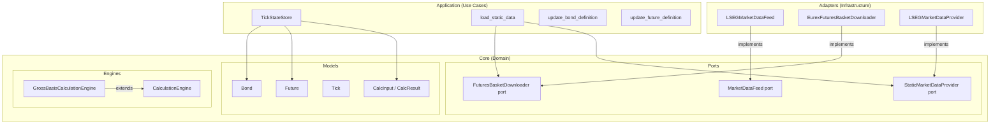

```mermaid
graph TD
    subgraph Adapters["Adapters (Infrastructure)"]
        A1[LSEGMarketDataFeed]
        A2[EurexFuturesBasketDownloader]
        A3[LSEGMarketDataProvider]
    end

    subgraph Application["Application (Use Cases)"]
        U1[TickStateStore]
        U2[load_static_data]
        U3[update_bond_definition]
        U4[update_future_definition]
    end

    subgraph Core["Core (Domain)"]
        subgraph Ports
            P1[MarketDataFeed port]
            P2[FuturesBasketDownloader port]
            P3[StaticMarketDataProvider port]
        end
        subgraph Models
            M1[Bond]
            M2[Future]
            M3[Tick]
            M4[CalcInput / CalcResult]
        end
        subgraph Engines
            E1[CalculationEngine]
            E2[GrossBasisCalculationEngine]
        end
    end

    A1 -->|implements| P1
    A2 -->|implements| P2
    A3 -->|implements| P3

    U1 --> M1
    U1 --> M2
    U1 --> M4
    U2 --> P2
    U2 --> P3
    E2 -->|extends| E1
```